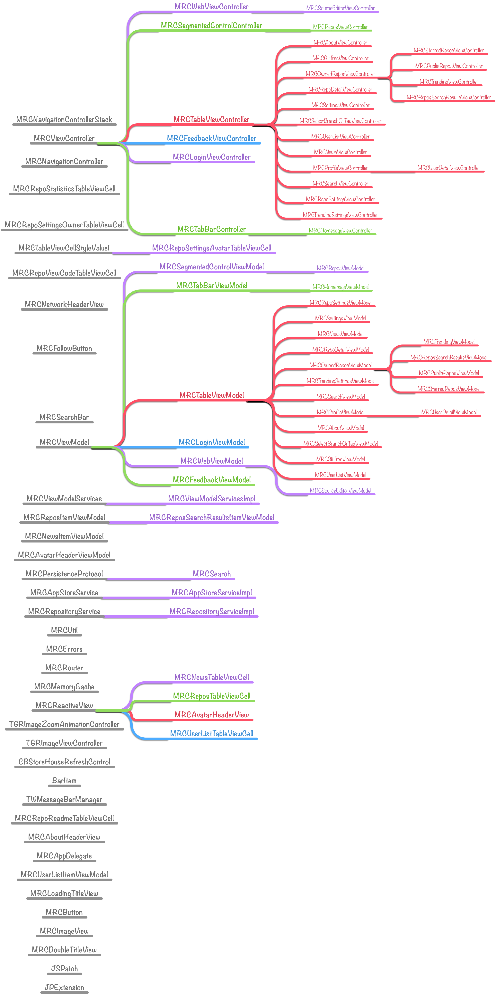

# MVVMReactiveCocoa

[](https://raw.githubusercontent.com/leichunfeng/MVVMReactiveCocoa/master/LICENSE)
[](https://github.com/leichunfeng/MVVMReactiveCocoa/tags)

This repository contains the source code for the [GitBucket](https://itunes.apple.com/cn/app/id961330940?mt=8) iOS app. It's a mobile client app for GitHub, building with [MVVM](http://en.wikipedia.org/wiki/Model_View_ViewModel) architectural pattern and some awesome frameworks, such as [ReactiveCocoa](https://github.com/ReactiveCocoa/ReactiveCocoa)、[Mantle](https://github.com/MantleFramework/Mantle)、[octokit.objc](https://github.com/octokit/octokit.objc), etc. You can use it for any purpose, free of charge.

# Purpose

The purpose that I developing this app is hope to provide a complete app which is developed using the MVVM architectural pattern and RAC framework, and can help some iOS developers who want to use this technology.

Now, GitBucket mainly include the following features:

1. View Owned & Starred repos, repo's README and source code.
2. View Followers & Following, Follow & Unfollow user.
3. Search repos, Star & Unstar repo.

The features is little now, but I will add more utility features at the iterative development in the future, such as **Activity**、**Gists**、**Issues**, etc.

# Class diagram



# Requirements

- iOS 8.0+
- CocoaPods 1.0+

# Contribution

If you want to make some contributions to this project or just want to build the project, please using the following command:

``` objc
git clone --recursive https://github.com/leichunfeng/MVVMReactiveCocoa.git
```

Everything will be done for you, and all you need to do is just waiting for it to finished. Once finished, you can open the project through double-click the `MVVMReactiveCocoa.xcworkspace` file and build the `MVVMReactiveCocoa` target. Any pull request will be welcome.

# Common problems

If you encountered the following error when you execute the `git clone` command:

``` objc
error: RPC failed; result=56, HTTP code = 200B | 0 bytes/s
fatal: The remote end hung up unexpectedly
fatal: early EOF
fatal: index-pack failed
```

Please execute the following command and then retry the previous `git clone` command again:

``` objc
git config --global core.compression -1
```

# License

MVVMReactiveCocoa is available under the MIT license. See the [LICENSE](LICENSE) file for more info.

# 相关文章

- [MVVM with ReactiveCocoa](http://blog.leichunfeng.com/blog/2016/02/27/mvvm-with-reactivecocoa/)
- [ReactiveCocoa v2.5 源码解析之架构总览](http://blog.leichunfeng.com/blog/2015/12/25/reactivecocoa-v2-dot-5-yuan-ma-jie-xi-zhi-jia-gou-zong-lan/)
- [Functor、Applicative 和 Monad](http://blog.leichunfeng.com/blog/2015/11/08/functor-applicative-and-monad/)
